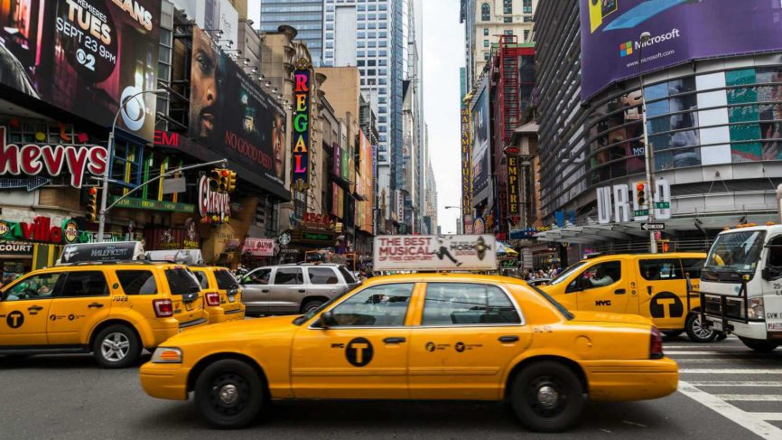

# ML_TaxiFare_Prediction
Predicting NYC Yellow Taxi Fare Amounts with Linear Regression: A Machine Learning Project Using June 2023 Trip Records.
Made this project with Python and its libraries: numpy, pandas, matplotlib, seaborn, scikit-learn.

  

Dataset: https://d37ci6vzurychx.cloudfront.net/trip-data/yellow_tripdata_2023-06.parquet
